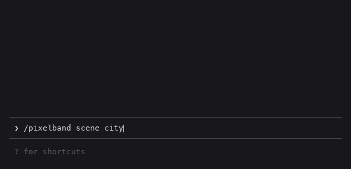

# pixelband

**Put any image above your Claude Code prompt as pixel art, and watch it react while Claude works.**



<sub>The art and effects are pixelband's own output, rendered frame by frame. The prompt box and labels around it are a mock-up, and a real terminal will look slightly different depending on your font.</sub>

I spend a lot of hours in Claude Code, and it looks the same for everyone. So I wanted to make mine
*mine*: a picture of my choosing sitting right above the prompt, one that actually knows what's
going on. It shimmers while Claude is working, sparkles when a turn finishes, and glitches when
something errors. It's a small thing, but it makes the terminal feel like your own space.

## Try it

pixelband is a **Claude Mod**, built on the function hooks Anthropic is shipping for Claude Code.
They're in preview right now, so for the moment you load it from a folder:

```bash
git clone https://github.com/furqan-khan07/pixelband
CLAUDE_CODE_ENABLE_FUNCTION_HOOKS=1 claude --plugin-dir ./pixelband
```

Then, inside Claude Code:

```
/pixelband set ~/Pictures/cat.jpg
```

Tip: type `/pixelband set ` and drag an image into the terminal. It pastes the path for you.

Once mods ship properly, it'll install like any other plugin.

## Commands

| | |
|---|---|
| `/pixelband set <image>` | use an image: PNG, JPEG, HEIC (iPhone photos), WebP, GIF and more |
| `/pixelband set <image> --here` | use it for **this project only**, so each repo gets its own banner |
| `/pixelband style <name>` | `original`, `gameboy`, `pico8`, `mono` or `sepia` |
| `/pixelband move <up\|down\|left\|right> [steps]` | aim the crop at the part of the picture you want |
| `/pixelband zoom <in\|out\|reset>` | zoom the crop in, up to 4x |
| `/pixelband layout <auto\|banner\|fit>` | `banner` fills the whole width with a crop; `fit` shows the whole image, centred. `auto` picks `fit` for logos and sprites with see-through backgrounds |
| `/pixelband size <rows>` | how tall the band is, 2 to 24 rows (two pixels per row) |
| `/pixelband colors <n>` | palette size for the `original` style, 2 to 32. Fewer colours reads more like pixel art |
| `/pixelband on` / `off` | show or hide it |
| `/pixelband clear [--here]` | forget the image |
| `/pixelband demo <mood>` | play `working`, `done`, `error` or `intro` on demand (good for screenshots) |

## Why pixel art and not the actual photo?

Because terminals are bad at photos. Real pixels only show up in a couple of terminals (Kitty and
Ghostty); everywhere else, even a full-width band is only about 100×24 pixels, and a photo shrunk that far
just looks like a smudge. So pixelband leans into it on purpose: it crops the image to the band's
shape (you choose which part with `move` and `zoom`), gives the colours a bit of punch, and cuts
it down to a small palette, so every block looks deliberate. The retro styles go further and map
the image onto a fixed palette with ordered dithering, the way a Game Boy or PICO-8 game would.

Each terminal cell shows two stacked pixels (the `▀` character in one colour over a background in
another), and see-through parts of a PNG let your terminal's background show through, so logos
and sprites blend right in.

## How it works

- **Everything runs locally.** Nothing is uploaded anywhere.
- **No dependencies.** Mods run in a sandbox with no image decoders, no compression APIs and no
  WebAssembly, so pixelband decodes PNG itself (including the zlib decompression) in plain
  TypeScript.
- **Photos go through your OS.** For JPEG, HEIC, WebP and friends it asks macOS's built-in `sips`
  (or ImageMagick on Linux) to convert and shrink the image first, so a 20 MB iPhone photo never
  gets pulled through the mod.
- **The animation is cheap.** Each mood is a pure function of time. While one plays, a timer swaps
  just the pixel grid 12 times a second, and when the band goes idle the timer stops entirely.

`claude plugin validate` lists everything a mod touches, and for pixelband that's:

```
hooks: session.start, turn.start, turn.complete, ui.render{component=AbovePrompt}, command.run{command=pixelband}
calls: $.clock.after, $.clock.every, $.command.register, $.env.get, $.fs.read, $.process.run,
       $.session.root, $.store.delete, $.store.get, $.store.set, $.ui.blit, $.ui.invalidate, $.ui.resolve
env reads: HOME, TMPDIR
```

`$.process.run` is only ever `sips`, `magick`/`convert` (to convert a photo) and `rm` (to delete
the temporary file that conversion makes).

## Limitations

- **Mods are in preview.** Anthropic says the API may change between releases, so pixelband might
  break on an update until mods ship for real.
- **Non-PNG images need `sips` or ImageMagick.** Every Mac has `sips`; on Linux, install
  ImageMagick or use a PNG.
- **It needs a terminal with true colour** (nearly all modern ones). Through tmux, colours can
  come out wrong unless true colour is enabled there.
- Only your own turns animate it. Subagents working in the background don't.

## Development

```bash
claude plugin validate .                                   # what the engine will load and refuse
CLAUDE_CODE_ENABLE_FUNCTION_HOOKS=1 claude plugin test .   # the test suite
python tests/fixtures/make_fixtures.py                     # rebuild the image fixtures (needs Pillow)
```

The decoders are checked pixel for pixel against Pillow, and against real `sips` output for the
photo path. For editor types, run `/plugin-types` inside Claude Code once. It writes the
declarations to `.claude/types`, which `tsconfig.json` picks up.

MIT licensed, see [LICENSE](LICENSE).
